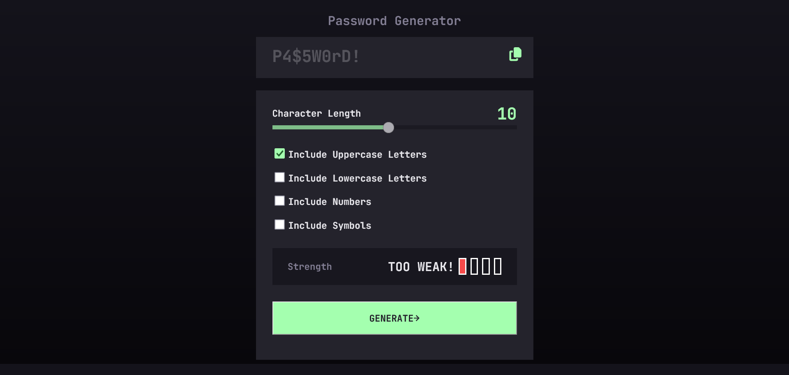

# Frontend Mentor - Password generator app solution

This is a solution to the [Password generator app challenge on Frontend Mentor](https://www.frontendmentor.io/challenges/password-generator-app-Mr8CLycqjh). Frontend Mentor challenges help you improve your coding skills by building realistic projects. 

## Table of contents

- [Overview](#overview)
  - [The challenge](#the-challenge)
  - [Screenshot](#screenshot)
  - [Links](#links)
- [My process](#my-process)
  - [Built with](#built-with)
  - [What I learned](#what-i-learned)
- [Author](#author)

## Overview

### The challenge

Users should be able to:

- Generate a password based on the selected inclusion options
- Copy the generated password to the computer's clipboard
- See a strength rating for their generated password
- View the optimal layout for the interface depending on their device's screen size
- See hover and focus states for all interactive elements on the page

### Screenshot

### Links

- Solution URL: [Solution URL](https://password-generator-app-weld-chi.vercel.app/)
- Live Site URL: [Add live site URL here](https://your-live-site-url.com)

## My process

### Built with

- Semantic HTML5 markup
- CSS custom properties
- Flexbox
- CSS Grid
- SASS

### What I learned

In this challenge I learned to develop more functions of JavaScript to generate the password, had to go deeper into learning more concepts to be able to complete this challenge.

Used Sass and tried to use it's concepts to help me achieve better stylesheets code.

Made a validation for a case when the user puts a length smaller than the number of checkboxes marked.

## Author

- Website - [Eduardo Castro](https://www.your-site.com)
- Frontend Mentor - [@EduardoLimaCastro](https://www.frontendmentor.io/profile/EduardoLimaCastro)
- LinkedIn - [@EduardoCastro](https://www.linkedin.com/in/eduardo-castro-0bb28973/)
- GitHUb - [@EduardoLimaCastro ](https://github.com/EduardoLimaCastro)

